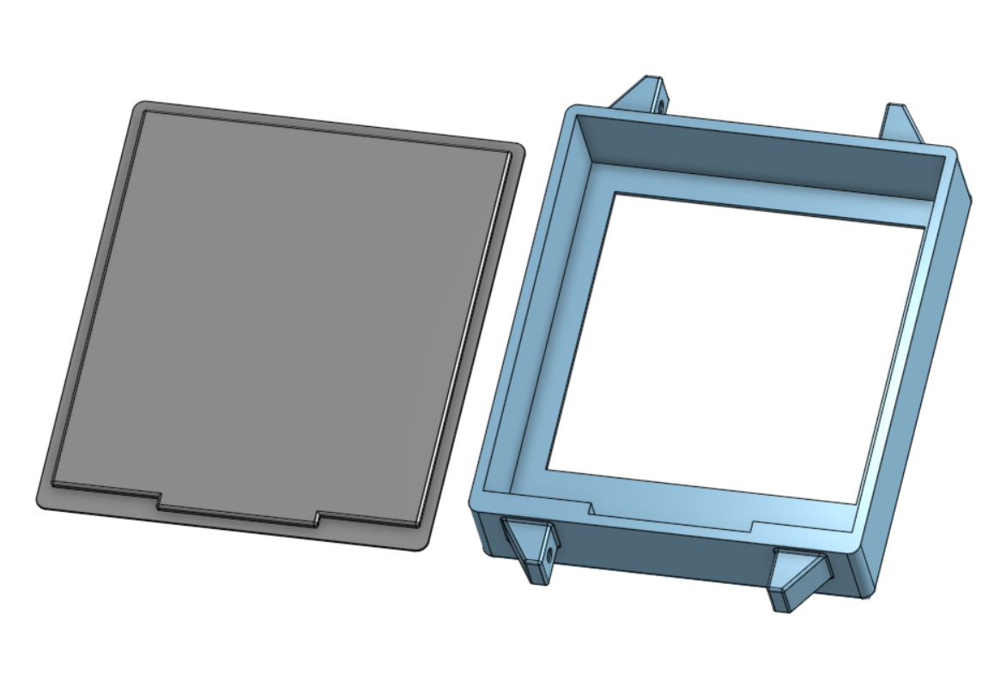

see [https://cad.onshape.com/documents/cb7162e245d0900f508fcb50/w/940c990f9d72fb5903e72538/e/1f520369415ae0e248c4032d](https://cad.onshape.com/documents/cb7162e245d0900f508fcb50/w/940c990f9d72fb5903e72538/e/1f520369415ae0e248c4032d) for an updated shell model / any other 3d print parts  
  
side ports/buttons are not included in this model, as pcb design is still undergoing design  

